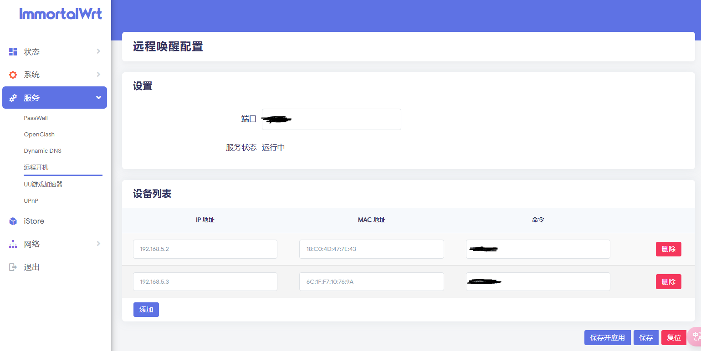

This is a Wake-on-LAN (WOL) server that features a LuCI web interface for configuration. It allows users to remotely activate devices on the local network from the public internet through a client application.

